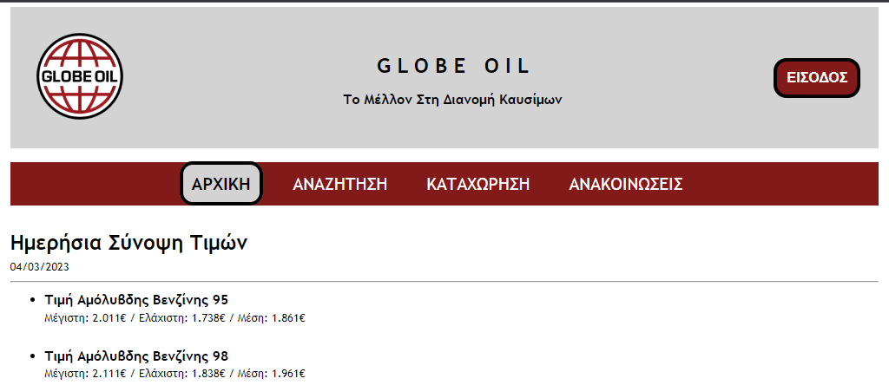

## Assignment 3 for PLI23


### Installation 
1) Download and install XAMPP for your system ```https://www.apachefriends.org/download.html```
2) Run the Installer
3) Follow the Instructions and choose to install MySQL.
4) Download all the files and place them inside ```hdocs``` folder of XAMPP directory.
5) Import database using ```phpmyadmin``` or create your own.


### Disclaimer
The current software was developed as part of the 3rd written assignment for the PLI23 course during the undergraduate programme of studies “Computer Science” of the Hellenic Open University. Thus it is not recommended to be used in real life website development.

### Security Risks
* The connection to MySQL server is not secure, as the password is stored in plaintext in the code. It is recommended to use environmental variables or a configuration file to store sensitive information.
* The code is vulnerable to SQL injection attacks, as user input is not properly sanitized before being used in SQL queries. It is recommended to use prepared statements or input validation to prevent this.
* The form does not have CSRF protection, which can allow attackers to execute unauthorized actions on behalf of the user. It is recommended to use a CSRF token in the form to prevent this.

## Software Development Team
* Zindros Stylianos
